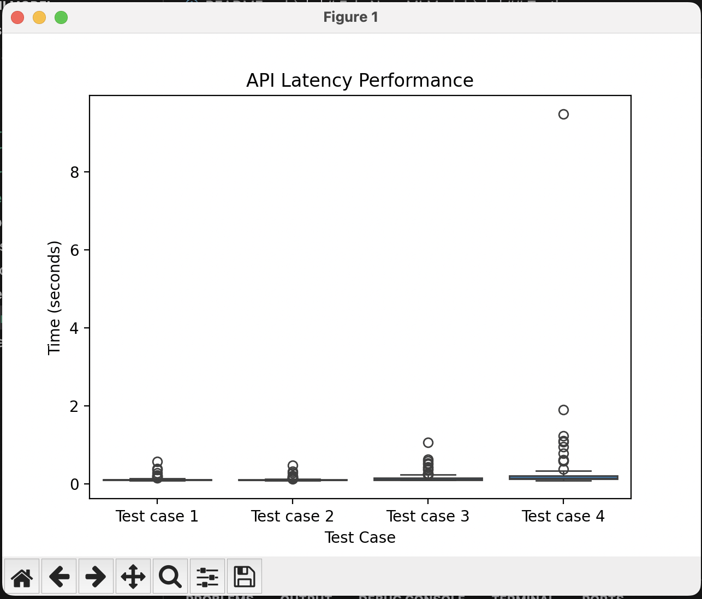

# FakeNewsMLModel

## Overview

This project is a Flask-based API that uses a machine learning model to predict whether a given text is fake news or not. The model is deployed using AWS Elastic Beanstalk.

## Project Structure

- `application.py`: Main Flask application file
- `basic_classifier.pkl`: Pickled machine learning model
- `count_vectorizer.pkl`: Pickled CountVectorizer for text transformation
- `.ebextensions/02_wsgi.config`: AWS Elastic Beanstalk configuration file
- `requirements.txt`: Python dependencies

## API Endpoints

1. Root endpoint:
   - URL: `/`
   - Method: GET
   - Description: Returns a simple message to confirm the app is running

2. Prediction endpoint:
   - URL: `/predict`
   - Method: POST
   - Input: JSON with a 'text' field
   - Output: JSON with a 'prediction' field

## Deployment

To deploy the application to AWS Elastic Beanstalk:

1. Ensure all required files are in your project directory.
2. Run the following command in your terminal:
   ```
   zip -r deployment_package.zip .ebextensions application.py basic_classifier.pkl count_vectorizer.pkl requirements.txt
   ```
3. Upload and deploy `deployment_package.zip` on AWS Elastic Beanstalk.

## Usage

After deployment, you can use the API by sending a POST request to the `/predict` endpoint with a JSON payload containing the 'text' to be classified.

Example using curl:

To test the API, run the following command:
`curl -X POST -H "Content-Type: application/json" -d '{"text":"ice cream is not taefdbet5sty"}' http://your-api-url/predict`

## Testing

To test the model, run the `tests/test_preds.py` script. This will print the predictions for each of the four test cases.

To test the performance of the model, run the `tests/test_performance.py` script. This will make 100 predictions for each of the four test cases and record the time it takes to make each prediction. The results are saved to a CSV file, which is then used to create a boxplot of the prediction times using the `tests/plot_performance.py` script.

The following is a the boxplot generated when testing:
